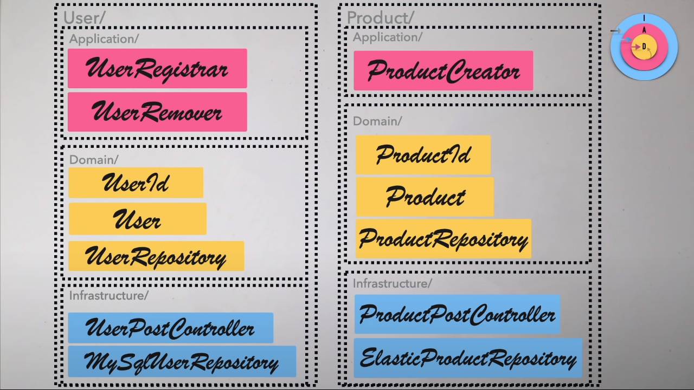
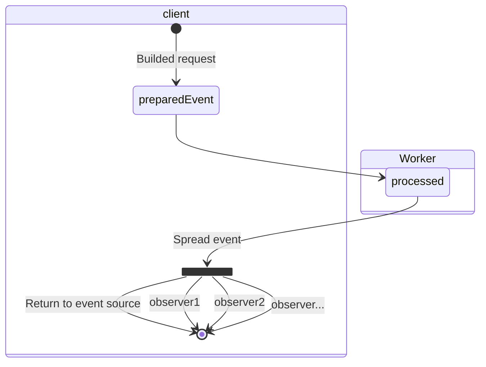
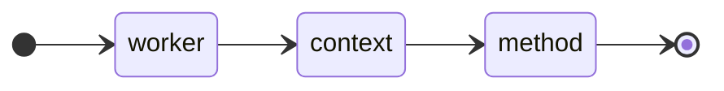

# Tiny WebWorker Event Driven Architecture

La idea de este proyecto es crear un proyecto base donde se use una arquitectura basada en eventos para usarlo con WebWorker

## ¿Porque pensar como una libreria a parte y no como una aplicación única?

La ventaja de hacer una libreria, es que es totalmente agnostico al framework que se use. ya sea react, vanillajs, svelte, angular, etc... Esta libreria ofrece libertad para usarse.

Para que sea fácil para otros desarrolladores, he decidido usar el patrón de código Factory para construir las request. [(Aqui un ejemplo)](https://github.com/RubenPX/Tiny-EDA-WebWorker/blob/72f26dbe01f743b3c5a8e05aa82494ee142edc39/frontend/src/App.svelte#L10-L12) Esto tiene varias ventajas al respecto, siendo la más importante que el desarrollador no tenga que preocuparse de cómo tiene hablar entre el navegador y el webworker. Toda la libreria esta realizada de modo se puedan recibir eventos (tanto de resultados como de errores)

## Estructura de proyecto

El proyecto está dividido en 2 partes.

- `Frontend`: Presentación para el usuario usando cualquier tipo de framework. (En este ejemplo uso SvelteJS)
- `App`: Carpeta donde se estructura la funcionalidad. Casos de uso, objetos, repositorios, etc... Es este caso se opta por usar Clean Architecture + Vertical Slicing. Todo siguiendo la opinión de [CodelyTV](https://www.youtube.com/watch?v=y3MWfPDmVqo) y [About Clean Code](https://www.youtube.com/watch?v=7ZXW_oWdTk4).

> Aquí está un concepto de cómo se reparte el código y sus carpetas.   
> En este caso, la proposición es `Que eres y que capa eres`
> 

## Funcionamiento de la aplicación

El objetivo de este repositorio es unicamente dejar en un hilo a parte el procesamiento de datos. Para ello se simula un "servidor" en forma de WebWorker.

Aquá debajo, se define como se comunica el cliente (Navegador) con el Hilo a parte ([WebWorker](https://developer.mozilla.org/es/docs/Web/API/Web_Workers_API/Using_web_workers)).

## Conceptos de esta plantilla

Esta plantilla diseñé un concepto que se basa en algunas ya hechas, pero con un algunos cambios. En este caso voy a expoer de como crear un handler para procesar un evento

La idea es sencilla de entender

El worker intercepta el mensaje, y busca un contexto. Una vez se haya encontrado un contexto, envia el mensaje al worker para que procese el metodo.

Todo empieza en la [inicialización del worker](https://github.com/RubenPX/Tiny-EDA-WebWorker/blob/39ea9c3803422f848fa5bf98256572b5f1534755/app/src/shared/WorkerManager.ts#L38-L49) (Aqui se instancia las bases de datos y los contextos).

- Un worker es un [EventBus](./app//src/shared/Routes/EventBus.ts#)
- Un contexto es una lista de [metodos](./app/src/shared/Routes/ContextRoute.ts#)
- Un metodo es un [runner](./app/src/shared/Routes/EventRunner.ts#) que ejecuta una [acción](./app/src/shared/Routes/EventRunner.ts#L9-L13)

Una vez se [recibe un evento](https://github.com/RubenPX/Tiny-EDA-WebWorker/blob/39ea9c3803422f848fa5bf98256572b5f1534755/app/src/shared/Routes/EventBus.ts#L18), el worker lo publica como un [evento de dominio](https://github.com/RubenPX/Tiny-EDA-WebWorker/blob/39ea9c3803422f848fa5bf98256572b5f1534755/app/src/shared/Routes/EventBus.ts#L35) y [busca el contexto mencionado](https://github.com/RubenPX/Tiny-EDA-WebWorker/blob/39ea9c3803422f848fa5bf98256572b5f1534755/app/src/shared/Routes/EventBus.ts#L66) en el mensaje. Una vez se ha encontrado el contexto, [se delega el mensaje a el contexto](https://github.com/RubenPX/Tiny-EDA-WebWorker/blob/39ea9c3803422f848fa5bf98256572b5f1534755/app/src/shared/Routes/EventBus.ts#L70). Ahí, el contexto, [busca el metodo que requiere](https://github.com/RubenPX/Tiny-EDA-WebWorker/blob/39ea9c3803422f848fa5bf98256572b5f1534755/app/src/shared/Routes/ContextRoute.ts#L20) y lo [delega a un runner](https://github.com/RubenPX/Tiny-EDA-WebWorker/blob/39ea9c3803422f848fa5bf98256572b5f1534755/app/src/shared/Routes/ContextRoute.ts#L24) que es el que se encarga de [procesar la solicitud del mensaje](https://github.com/RubenPX/Tiny-EDA-WebWorker/blob/39ea9c3803422f848fa5bf98256572b5f1534755/app/src/shared/Routes/EventRunner.ts#L12-L15)

## Roadmap

- [X] Enviar y recibir eventos entre el worker y el browser
- [X] Permitir la observación de eventos
- [X] El control de errores, en consola, te referencia exactamente donde ha fallado el webworker en vez de mostrar un error generico
- [X] logs mejorados en consola (Para ver los eventos, requiere que tengas verbose activado en las devtools)
- [X] Auto completado de rutas usando typescript
- [X] A la hora de navegar código, con el ctrl + click te lleva a el metodo que lo ejecuta sin que vaya a las clases abstractas

## Roadmap (Técnicas usadas)

La idea de este proyecto ha surgido de una necesidad en el trabajo. Organizar Código y optimizar la aplicación

Primero lo que pensé es en crear algo usando las técnicas de [arquitectura hexagonal](https://blog.cleancoder.com/uncle-bob/2012/08/13/the-clean-architecture.html).

después explorando y haciendo pruebas, me di cuenta que era algo tedioso que ir moviéndose a diferentes niveles de carpetas, así que descubrí la técnica "[Vertical Slice](https://blog.ndepend.com/vertical-slice-architecture-in-asp-net-core/)" que se aplica en arquitectura hexagonal

Mas tarde, decidí usar una tecnología que usan los navegadores que se llama [Web Workers Api](https://developer.mozilla.org/en-US/docs/Web/API/Web_Workers_API) según una web muy relevante en el mundo del frontend, [es compatible con el 98% de los navegadores](https://caniuse.com/webworkers). En resumen, consiste en dejar todo el trabajo de procesamiento separado en un hilo diferente. Es algo costoso al principio, pero vale la pena para mejorar la experiencia de usuario y evitar que la aplicación tengo micro cuelgues

Por último, para hacer que este trabajo sea totalmente agnóstico a cualquier framework web que se use, decidi convertir el proyecto en una librería

## Opinión

Esta estructura de carpetas es una forma opinionada de como creo yo @RubenPX de cuál es la forma que mejor me parece a la hora de estructurar las carpetas y el estilo de código.

## Library features

- Hybrid support - CommonJS and ESM modules
- IIFE bundle for direct browser support without bundler
